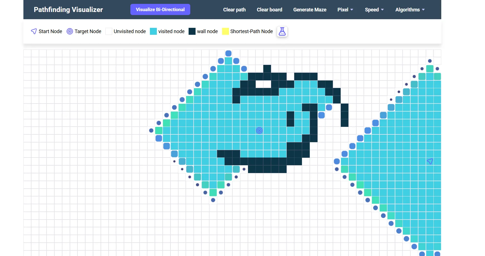
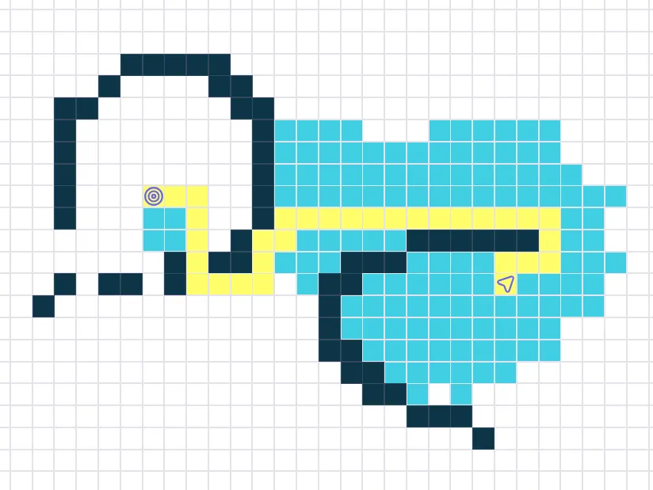
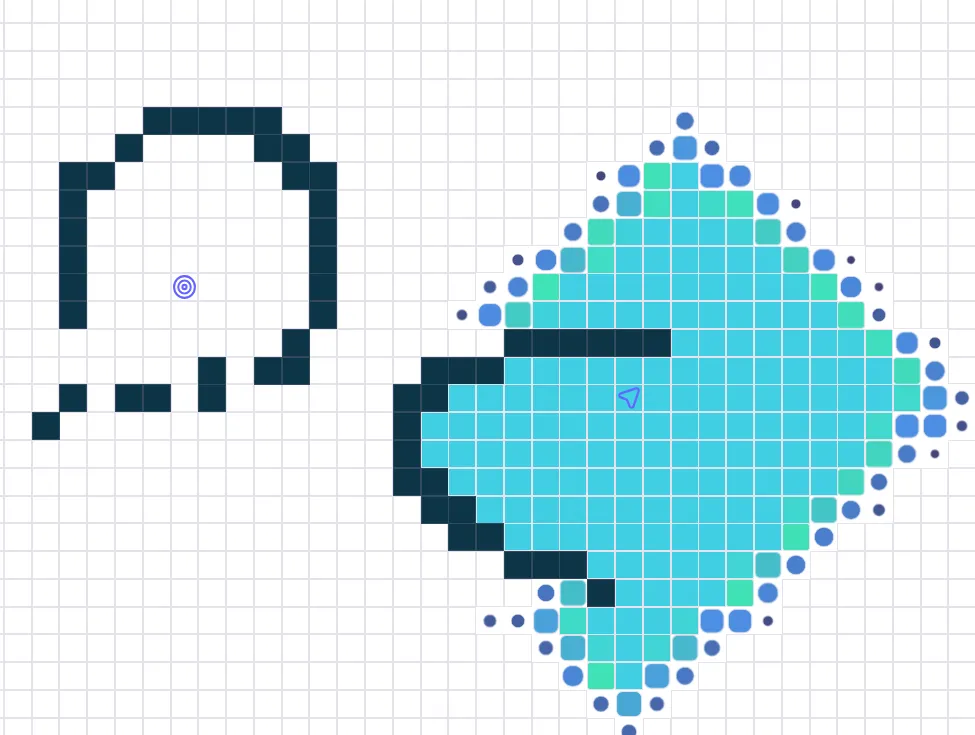
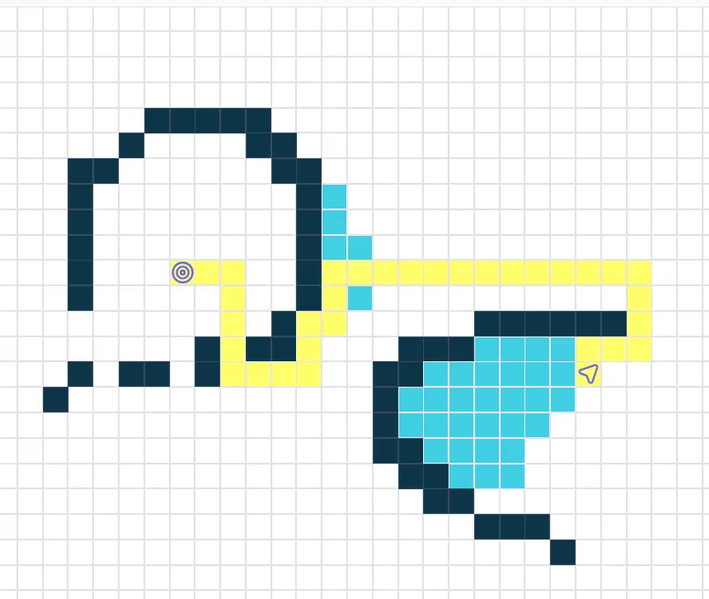
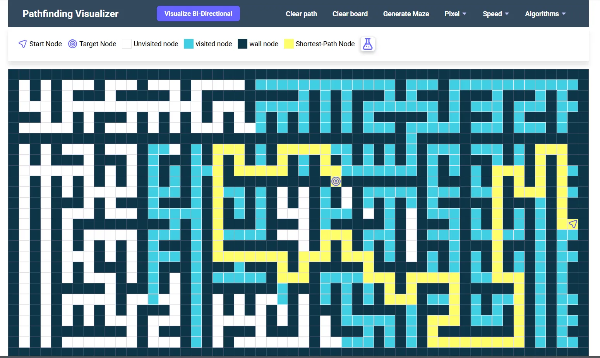

# 🚀 GraphNav – Pathfinding Visualizer

**GraphNav** is an interactive pathfinding visualizer designed to help understand and compare classical graph traversal and shortest-path algorithms through real-time animations on a 2D grid.

This project focuses on **algorithmic behavior**, **visual clarity**, and **hands-on interaction**, making it useful for both learning and technical demonstration.

👉 **Live Demo:**  
🔗 https://path-explorer.netlify.app/

  
*Visualizing how algorithms navigate through obstacles to find optimal paths.*

---

## ✨ Key Features

### 🧩 Interactive Grid System
- Click and drag to **draw walls / obstacles**
- **Movable start and target nodes**
- Dynamic grid resizing using pixel controls
- Random maze generation for complex scenarios

### 🧠 Pathfinding Algorithms
- **Breadth-First Search (BFS)**
- **Depth-First Search (DFS)**
- **Dijkstra’s Algorithm** (weighted shortest path)
- **A\*** Search (Manhattan heuristic)
- **Greedy Best-First Search**
- **Bi-Directional BFS**

Each algorithm is animated step-by-step to clearly show:
- Node exploration order
- Visited states
- Final shortest path reconstruction

### 🎛 Visualization & Learning Tools
- Adjustable animation speed (slow → fast)
- Clear distinction between visited, wall, and path nodes
- Step-wise visualization for better understanding
- Built-in **tutorial mode** for first-time users

---

## 🖥️ Screenshots Gallery

|  |  |
|----------------------------------------------------|-----------------------------------------------|
| *Interactive Tutorial Mode*                        | *A\* Algorithm Visualization*                 |

|  |  |
|------------------------------------------------|---------------------------------------------|
| *Dijkstra’s Algorithm in Action*                | *Greedy Best-First Search*                  |

|  |
|---------------------------------------------------|
| *Recursive Division Maze Generation*              |

---

## 🛠 Tech Stack

- **HTML5** – structure & layout  
- **CSS3** – animations, themes, responsive UI  
- **Vanilla JavaScript** – logic & interactions  
- **Data Structures & Algorithms** – core pathfinding logic  

No frameworks were used — the project is built from scratch to strengthen core fundamentals.

---


## 📁 Project Structure

The repository is intentionally kept simple and modular for easy understanding and extensibility:

```text
GraphNav-Pathfinding-Visualizer/
│
├── index.html          # Main HTML entry point (UI structure)
├── app.js              # Core application logic (grid, algorithms, animations)
│
├── CSS/
│   ├── main.css        # Core styles, layout, animations
│   └── utility.css     # Reusable utility classes & visual helpers
│
├── assets/
│   ├── icon/           # UI icons (source, target, controls)
│   ├── screenshots/    # README and documentation visuals
│   └── tutorial/       # Tutorial images and GIFs
│
├── robots.txt          # Search engine crawling rules
├── sitemap.xml         # Sitemap for SEO indexing
│
└── README.md           # Project documentation

## 🚀 Getting Started


---

### Option 1: Run Online
Open the live demo and start exploring immediately:  
🔗 https://path-explorer.netlify.app/

### Option 2: Run Locally
```bash
git clone https://github.com/deepakvishwakarma24/GraphNav-Pathfinding-Visualizer.git
cd GraphNav-Pathfinding-Visualizer
# Open index.html in your browser
